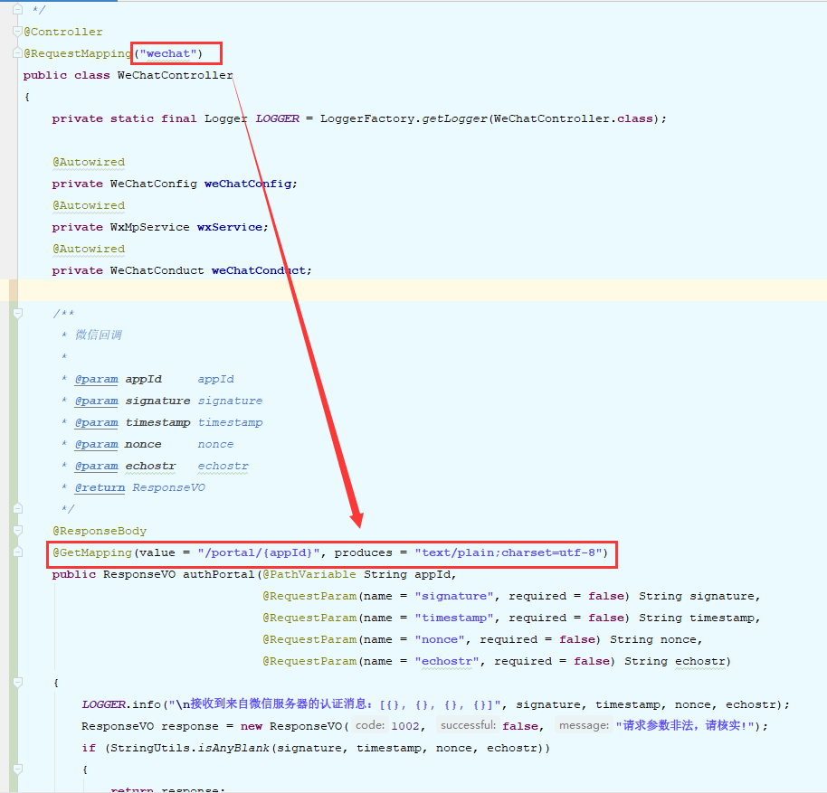
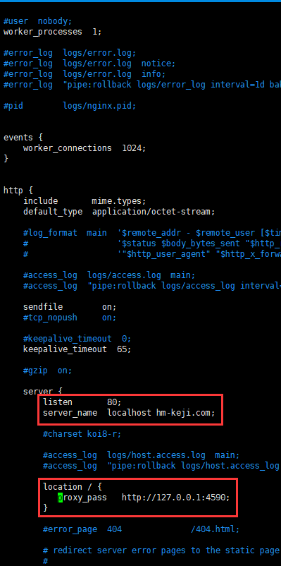
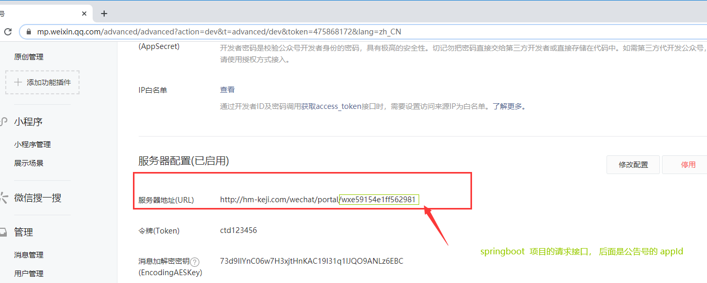
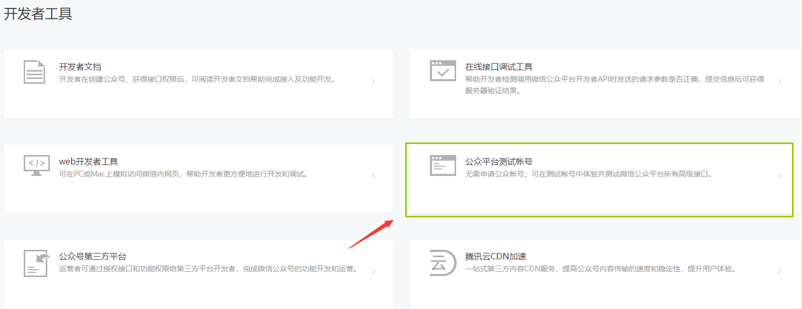
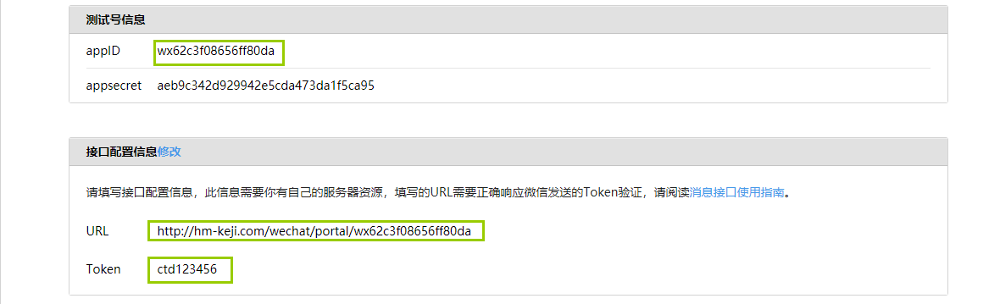
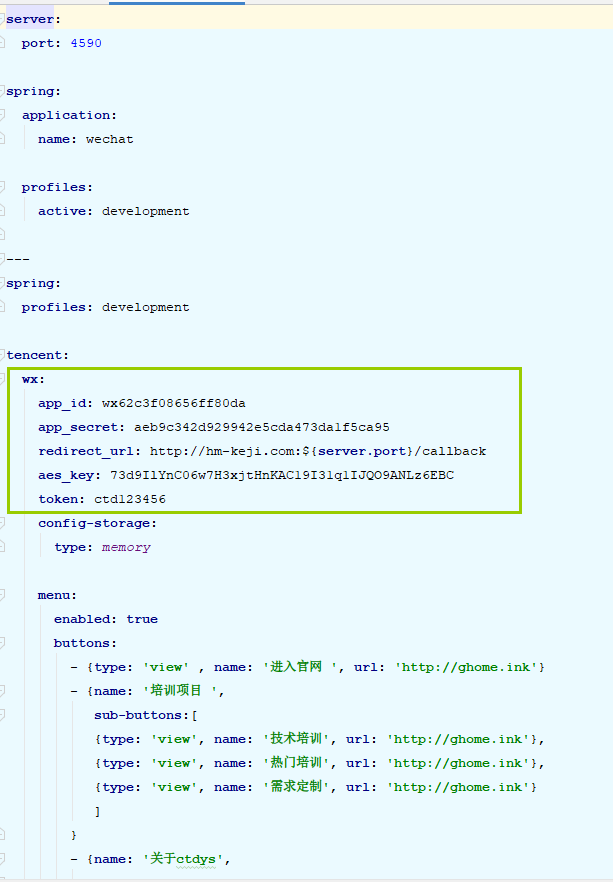
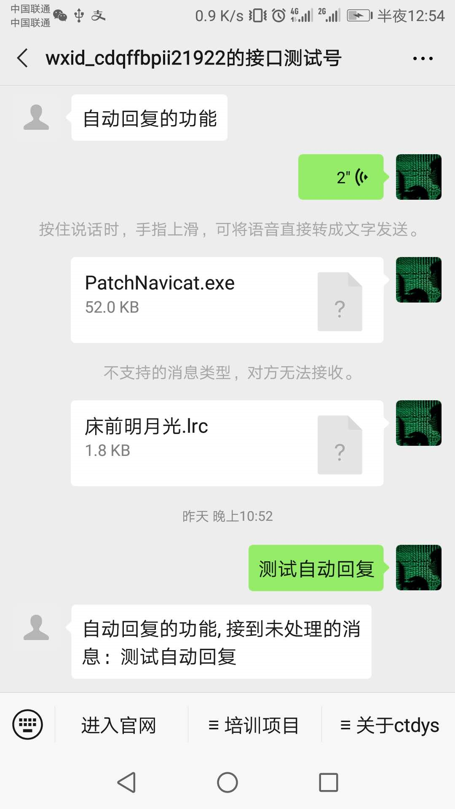

### 微信公众号开发

###### 编写文档的目的，让新手更快的入门开发

##### 声明：广东护苗公司是个不错的公司，很不好的是由于经营不善已经停业，我只用公司的域名希望更多人知道有护苗公司，也希望有识之士可以投资该公司，让他重新立足于市场，本人不胜感激，如果有侵权域名，请联系本人删除域名的使用， 谢谢。

#### 在微信公众号申请一个公众号， 本人是个人订阅号，功能比较少。

#### 微信公众号地址：<https://mp.weixin.qq.com/>

#### 重点服务器配置

> 1 保证服务器能在公网且开放 80 端口
>
> 2 在服务器编写一个接口，用于微信服务器配置 url 请求的接口， 参数列表（appId, signature, timestamp, nonce, echostr）只有appId 需要填写，其他四个参数微信验证 url 有效性会自己传过去。
>
> 3 我用springboot 开发接口如 图 1
>
> 4 部署 springboot 项目到应用服务器， 开放项目端口。因为项目80端口， 使用nginx 80 转发到你的项目端口，例如我的是 4590， 在conf/nginx.conf 文件配置如 图2
>
> 5 上面工作完成后，到微信公众号平台配置 服务器地址 如 图3
>
> 6 上面的步骤不要反，因为本人之前不懂，以为配置 域名就可以了，提交老师报 token 验证失败，因为没有提供验证接口，天真以为配置到域名就可以了，试了一天老是报 token 验证失败，没脾气了吧。后来在自己的服务器提供验证接口后，点击提交配置... 成功! 顿时流出幸福的泪水....

### 图1

### 图2

### 图3

#### 重点如果你也跟我一样是个人订阅号，因为自定义菜单和一些接口需要 微信认证才能使用，你可以像我一样用测试账号，填写相关的配置

### springboot  yml 配置

### 最终的效果：

### 谢谢观看 end

